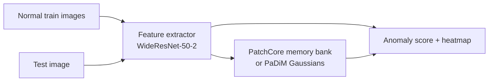
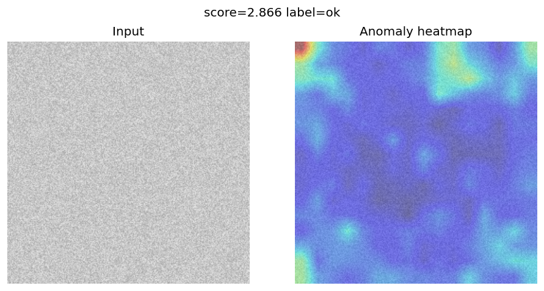
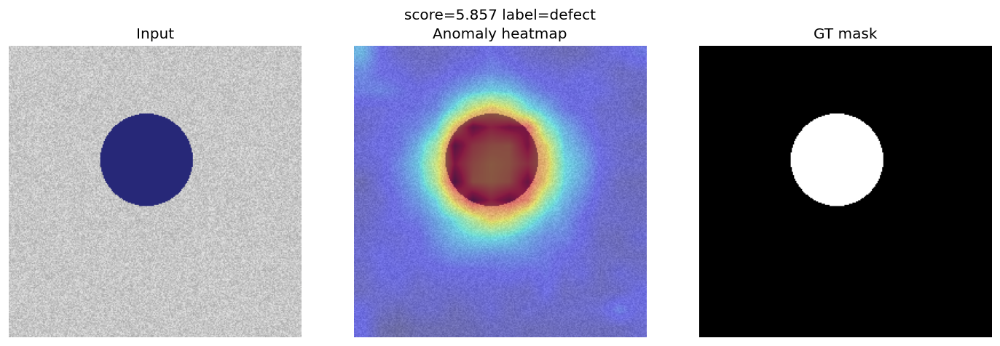

# VisionAnomaly

[](https://github.com/Naman1821/VisionAnomaly)

**Unsupervised industrial defect detection** on [MVTec-AD](https://www.mvtec.com/company/research/datasets/mvtec-ad) using **PatchCore** and **PaDiM** — trained only on normal images, detects defects at test time with pixel-level heatmaps.

---

## What it does

1. **Train** on defect-free product images only (no labels needed — fully unsupervised).
2. **Test** on mixed good + defective images.
3. Output: **anomaly score** + **pixel-level heatmap** showing suspected defect regions.



### Sample output (real MVTec-AD bottle)

| Normal (OK) | Defect (heatmap + ground truth) |
|:-----------:|:-------------------------------:|
|  |  |

---

## Results (MVTec-AD bottle — real dataset)

| Model | Image AUROC | Pixel AUROC | Test images |
|-------|-------------|-------------|-------------|
| **PatchCore** | **0.998** | **0.976** | 83 |
| PaDiM | 0.992 | 0.961 | 83 |

> Trained on 209 defect-free bottle images. Evaluated on 83 test images (20 good + 63 defective across broken_large, broken_small, contamination).

---

## Quick start

```bash
git clone https://github.com/Naman1821/VisionAnomaly.git
cd VisionAnomaly
python3 -m venv .venv && source .venv/bin/activate
pip install -r requirements.txt
```

### Option A — Streamlit demo (recommended)

Pre-trained weights and 12 real sample images are bundled. Just run:

```bash
pip install -r requirements.txt
streamlit run streamlit_app.py
```

Open **http://localhost:8501** — pick a sample, click **Run**, see the heatmap.

**Live demo:** [visionanomaly.streamlit.app](https://visionanomaly.streamlit.app)

> Streamlit Cloud: set **Python 3.11**, main file `streamlit_app.py`. If the link fails, open [Manage app](https://share.streamlit.io) → check status is **Running** (not Failed), then **Reboot**.

> To retrain from scratch, place [MVTec bottle archive](https://www.mvtec.com/company/research/datasets/mvtec-ad/downloads) at `data/bottle.tar.xz` and run `python train.py`.

### Option B — Full pipeline

```bash
# Data
python scripts/download_mvtec.py --category bottle

# Train PatchCore
python scripts/train.py -c configs/default.yaml

# Evaluate + heatmaps + metrics.json
python scripts/evaluate.py -c configs/default.yaml

# Compare PatchCore vs PaDiM
python scripts/compare.py --category bottle

# Gradio demo (localhost:7860)
CHECKPOINT=outputs/bottle/patchcore python app/gradio_demo.py
```

Or use Make: `make install download train eval demo`

---

## Project structure

```
VisionAnomaly/
├── train.py                       # one-step: extract data → train → demo samples
├── streamlit_app.py               # Streamlit UI — click sample, see heatmap
├── configs/default.yaml           # category, model, image size, device
├── scripts/
│   ├── download_mvtec.py          # per-category MVTec download (HF / toy)
│   ├── create_toy_mvtec.py        # synthetic smoke-test data
│   ├── train.py                   # train PatchCore or PaDiM
│   ├── evaluate.py                # test metrics + heatmaps
│   └── compare.py                 # PatchCore vs PaDiM comparison
├── src/visionanomaly/
│   ├── data/mvtec.py              # MVTec-AD dataset loader
│   ├── features/extractor.py      # frozen WideResNet-50-2 multi-scale features
│   ├── models/
│   │   ├── patchcore.py           # coreset memory bank + k-NN scoring
│   │   ├── padim.py               # per-location Gaussian + Mahalanobis
│   │   └── factory.py             # model builder
│   ├── engine/evaluator.py        # batch evaluation loop
│   ├── metrics/auroc.py           # image & pixel AUROC
│   └── viz/heatmap.py             # score map overlay + triptych export
├── app/
│   ├── gradio_demo.py             # Gradio interactive demo
│   └── fastapi_server.py          # REST API for inference
├── model/                         # trained weights (auto-generated)
│   ├── patchcore_weights.bin      # PatchCore memory bank + threshold
│   └── score_threshold.txt        # calibrated normal/defect threshold
├── sample_images/                 # bundled demo images (real MVTec bottle)
│   ├── good/                      # 6 normal test bottles
│   └── defective/                 # 6 defects (broken_large, broken_small, contamination)
├── docs/samples/                  # README sample output images
├── tests/test_metrics.py
├── Dockerfile
├── requirements.txt
└── outputs/                       # eval results + heatmaps (gitignored)
```

---

## Methods

| Method | Core idea | Distance metric |
|--------|-----------|-----------------|
| **PatchCore** | Coreset-sampled memory bank of normal patch embeddings | k-NN (Euclidean) |
| **PaDiM** | Per-location multivariate Gaussian on reduced features | Mahalanobis |

Both use a **frozen WideResNet-50-2** pretrained on ImageNet — zero gradient updates during training (10x faster than supervised alternatives).

---

## Configuration

Edit `configs/default.yaml`:

- `data.category` — `bottle`, `cable`, `capsule`, …
- `model.name` — `patchcore` | `padim`
- `model.coreset_sampling_ratio` — memory bank size (PatchCore)
- `device` — `auto` | `cuda` | `mps` | `cpu`

---

## API

```bash
CHECKPOINT=outputs/bottle/patchcore uvicorn app.fastapi_server:app --port 8000
curl -X POST http://localhost:8000/predict/json -F "file=@test.png"
```

---

## Requirements

- Python 3.10+
- ~200 MB disk for bottle category
- GPU/MPS recommended; CPU works at 256px

---

## License

MIT — MVTec-AD dataset has its own [license](https://www.mvtec.com/company/research/datasets/mvtec-ad).
