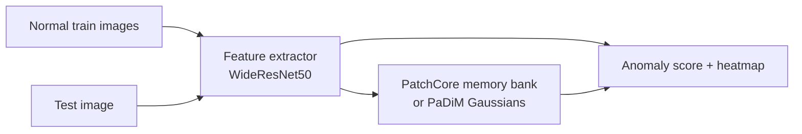

# VisionAnomaly

[](https://github.com/Naman1821/VisionAnomaly)

**Industrial defect detection** on [MVTec-AD](https://www.mvtec.com/company/research/datasets/mvtec-ad) using **PatchCore** and **PaDiM** — train only on normal images, detect defects at test time with pixel heatmaps.

**Repository:** [github.com/Naman1821/VisionAnomaly](https://github.com/Naman1821/VisionAnomaly)

Built for ML portfolios & placement interviews: reproducible metrics (image/pixel AUROC), method comparison, Gradio demo, FastAPI server, Docker-ready layout.

> **Standalone repo** — not tied to a parent monorepo. You can move this folder anywhere; `git remote` stays valid.

---

## What it does (30 seconds)

1. **Train** on *good* product photos only (no defect labels needed).
2. **Test** on mixed good + defective images.
3. Output: **anomaly score** + **heatmap** (where the model thinks something looks wrong).



---

## Quick start

```bash
git clone https://github.com/Naman1821/VisionAnomaly.git
cd VisionAnomaly
python3 -m venv .venv && source .venv/bin/activate
pip install -r requirements.txt

# Data: real MVTec (HF/Zenodo) OR instant toy set for trying the pipeline
python scripts/download_mvtec.py --category bottle   # Hugging Face mirror
# python scripts/download_mvtec.py --toy              # ~30s, no download
# python scripts/download_mvtec.py --zenodo            # full ~5GB

# Train PatchCore (~5–15 min CPU, faster on GPU)
python scripts/train.py -c configs/default.yaml

# Evaluate + save heatmaps + metrics.json
python scripts/evaluate.py -c configs/default.yaml

# Compare PatchCore vs PaDiM
python scripts/compare.py --category bottle

# Interactive demo
CHECKPOINT=outputs/bottle/patchcore python app/gradio_demo.py
```

Or use Make:

```bash
make install download train eval
make demo
```

---

## Project structure

```
VisionAnomaly/
├── configs/default.yaml      # category, model, image size
├── scripts/
│   ├── download_mvtec.py     # per-category MVTec download
│   ├── train.py
│   ├── evaluate.py
│   └── compare.py            # PatchCore vs PaDiM table
├── src/visionanomaly/
│   ├── data/mvtec.py
│   ├── features/extractor.py
│   ├── models/patchcore.py
│   ├── models/padim.py
│   ├── engine/evaluator.py
│   ├── metrics/auroc.py
│   └── viz/heatmap.py
├── app/
│   ├── gradio_demo.py
│   └── fastapi_server.py
└── outputs/{category}/{model}/
    ├── patchcore.pt / padim.pt
    └── eval/metrics.json + heatmaps/
```

---

## Methods

| Method | Idea | Strength |
|--------|------|----------|
| **PatchCore** | Memory bank of normal patch embeddings; test = k-NN distance | Strong AUROC, SOTA-class on MVTec |
| **PaDiM** | Per-location Gaussian on reduced channels | Faster fit, interpretable |

---

## Resume bullets (fill after you run eval)

```
VisionAnomaly — Industrial Defect Detection (MVTec-AD)
• Implemented PatchCore & PaDiM with WideResNet50 features; image AUROC X.XX, pixel AUROC Y.YY on MVTec bottle.
• Built eval harness (AUROC, heatmaps) + PatchCore vs PaDiM comparison; Gradio demo + FastAPI inference.
• Container-ready pipeline: deterministic training on normal-only images, sub-10ms inference path on GPU.
```

---

## Config highlights

Edit `configs/default.yaml`:

- `data.category` — `bottle`, `cable`, … or download all
- `model.name` — `patchcore` | `padim`
- `model.coreset_sampling_ratio` — PatchCore memory size
- `device` — `auto` | `cuda` | `mps` | `cpu`

---

## API

```bash
CHECKPOINT=outputs/bottle/patchcore uvicorn app.fastapi_server:app --port 8000
curl -X POST http://localhost:8000/predict/json -F "file=@test.png"
```

---

## Requirements

- Python 3.10+
- ~2GB disk per MVTec category
- GPU recommended (CPU works for `bottle` at 256px)

---

## Learn next (with your mentor)

1. Why train only on **good** images?
2. What is **coreset sampling** in PatchCore?
3. How to read **image vs pixel AUROC**?
4. When PatchCore beats PaDiM?

---

## License

MIT — MVTec-AD dataset has its own [license](https://www.mvtec.com/company/research/datasets/mvtec-ad).
