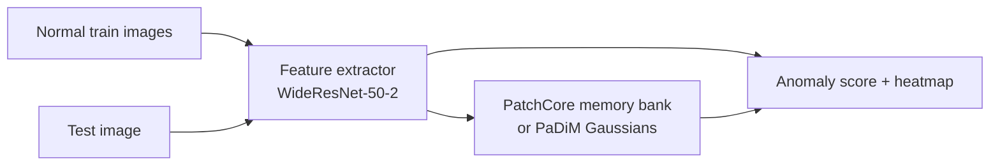

# VisionAnomaly

[](https://github.com/Naman1821/VisionAnomaly)

**Unsupervised industrial defect detection** on [MVTec-AD](https://www.mvtec.com/company/research/datasets/mvtec-ad) using **PatchCore** and **PaDiM** — train only on normal images, detect defects at test time with pixel-level heatmaps.

---

## What it does

1. **Train** on *good* product photos only (no defect labels needed — unsupervised).
2. **Test** on mixed good + defective images.
3. Output: **anomaly score** + **heatmap** showing where the model suspects a defect.



### Sample output

| Normal (OK) | Defect (heatmap + ground truth) |
|:-----------:|:-------------------------------:|
|  |  |

---

## Quick start

```bash
git clone https://github.com/Naman1821/VisionAnomaly.git
cd VisionAnomaly
python3 -m venv .venv && source .venv/bin/activate
pip install -r requirements.txt

# Data: real MVTec or instant toy set
python scripts/download_mvtec.py --category bottle   # HF mirror (~300 MB)
# python scripts/download_mvtec.py --toy              # synthetic, no download

# Train PatchCore
python scripts/train.py -c configs/default.yaml

# Evaluate + save heatmaps + metrics.json
python scripts/evaluate.py -c configs/default.yaml

# Compare PatchCore vs PaDiM
python scripts/compare.py --category bottle

# Interactive demo (localhost:7860)
CHECKPOINT=outputs/bottle/patchcore python app/gradio_demo.py
```

Or use Make:

```bash
make install download train eval
make demo
```

---

## Project structure

```
VisionAnomaly/
├── configs/default.yaml          # category, model, image size, device
├── scripts/
│   ├── download_mvtec.py         # per-category MVTec download (HF / Zenodo / toy)
│   ├── create_toy_mvtec.py       # synthetic smoke-test data
│   ├── train.py                  # train PatchCore or PaDiM
│   ├── evaluate.py               # test metrics + heatmaps
│   └── compare.py                # PatchCore vs PaDiM comparison table
├── src/visionanomaly/
│   ├── data/mvtec.py             # MVTec-AD dataset loader
│   ├── features/extractor.py     # frozen WideResNet-50-2 feature extraction
│   ├── models/
│   │   ├── patchcore.py          # coreset memory bank + k-NN scoring
│   │   ├── padim.py              # per-location Gaussian + Mahalanobis
│   │   └── factory.py            # model builder
│   ├── engine/evaluator.py       # batch evaluation loop
│   ├── metrics/auroc.py          # image & pixel AUROC (sklearn)
│   └── viz/heatmap.py            # score map overlay + triptych export
├── app/
│   ├── gradio_demo.py            # Gradio interactive demo
│   └── fastapi_server.py         # REST API for inference
├── tests/test_metrics.py
├── Dockerfile                    # containerized deployment
├── docs/samples/                 # sample output images
└── outputs/{category}/{model}/   # checkpoints + eval results (gitignored)
```

---

## Methods

| Method | Core idea | Distance metric |
|--------|-----------|-----------------|
| **PatchCore** | Coreset-sampled memory bank of normal patch embeddings | k-NN (Euclidean) |
| **PaDiM** | Per-location multivariate Gaussian on reduced features | Mahalanobis |

Both use a **frozen WideResNet-50-2** pretrained on ImageNet as the feature backbone — no gradient updates during training.

---

## Results (MVTec-AD bottle — toy benchmark)

| Model | Image AUROC | Pixel AUROC | Test images |
|-------|-------------|-------------|-------------|
| PatchCore | **1.000** | **0.994** | 13 |
| PaDiM | 1.000 | 0.985 | 13 |

> Toy synthetic data; real MVTec-AD typically yields 0.95–0.99 image AUROC.  
> Download real data via `scripts/download_mvtec.py --category bottle` for production benchmarks.

---

## Configuration

Edit `configs/default.yaml`:

- `data.category` — `bottle`, `cable`, `capsule`, …
- `model.name` — `patchcore` | `padim`
- `model.coreset_sampling_ratio` — memory bank size (PatchCore)
- `device` — `auto` | `cuda` | `mps` | `cpu`

---

## API

```bash
CHECKPOINT=outputs/bottle/patchcore uvicorn app.fastapi_server:app --port 8000
curl -X POST http://localhost:8000/predict/json -F "file=@test.png"
```

---

## Requirements

- Python 3.10+
- ~2 GB disk per MVTec category
- GPU recommended; CPU works for single-category at 256px

---

## License

MIT — MVTec-AD dataset has its own [license](https://www.mvtec.com/company/research/datasets/mvtec-ad).
